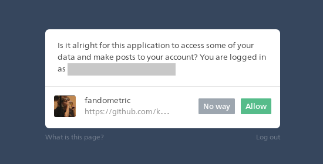

# Fandometric

A browser-based local utility for tracking your tumblr following. Written in [python 3.5](https://www.python.org/downloads/release/python-352/).

## Downloading Fandometric

If you know how to use git, you can skip this section. 

Otherwise you can download a copy of Fandometric by going to the Download ZIP button on the side of this page. *You do not need to fork this repository unless you intend to modify Fandometric and want to post your changes.*

Extract the ZIP file to anywhere on your computer. Run `main.py` to start the Fandometric server.

Fandometric depends on the following non-standard modules: `httplib2`, `flask`, `flask_socketio`, `eventlet`. If they are not installed, Fandometric will give you the option to have it install them automatically for you. Modules will be installed in the user space (with `pip3 --user`).

## First time use

Fandometric works by taking snapshots of your tumblr following and comparing the changes between them. To do this, Fandometric needs access to your tumblr account. Fandometric can get the required keys for you as long as you give it permission.

You will be prompted for a fandometric passkey. Official fandometric passkeys are currently only available to certain members of the Taylor Swift fandom. *If you do not have one*, you can generate your own unofficial fandometric passkey by [registering](https://www.tumblr.com/oauth/apps) your copy of fandometric separately with tumblr. Doing so will give you your own consumer key and consumer secret which you can plug directly into the `oauth.Consumer()` constructor in `authorize.py` (you will have to modify the source code).

You will then be sent to a tumblr authorization page, where you must authorize Fandometric to read data off of your account.

If successful, Fandometric is now linked to your tumblr account and ready to use.

Fandometric will have saved the OAuth keys in a file called `tumblr_keys.txt` so you won’t have to go through this process each time you use it. **Never share your OAuth keys; they are more or less equivalent to your tumblr password.**

## Usage
Fandometric emulates a bash terminal in the browser. All fandometric commands are prefixed with the command `fm`.

    fm update * [url1 --celeb=url2] --cache -c

Downloads the current follower/following list for your account from tumblr and saves the data as `n.txt`, where `n` is one greater than the highest numbered file in `/records`. Replace `url1` with the url of your tumblr blog *without* quotes. (A tumblr url does not include “http://” or “.tumblr.com”). Optional parameter `--celeb` can be added immediately after each url to specify a celebrity follow to detect while Fandometric copies your followers list. You can specify more than one blog–celebrity pair. If `--cache` or `-c` is added anywhere in the arguments, Fandometric will remember the command and you can use it with the `fm go` shortcut.

Example usage:

`fm update kaylornation --celeb=taylorswift taytaysbeard --celeb=karliekloss -c`

Downloads the followers on blog `kaylornation.tumblr.com` and `taytaysbeard.tumblr.com` (if you have ownership of those blogs) and keeps a lookout for whether `taylorswift` and `karliekloss` follow each blog, respectively. The command will be saved in `terminal.txt` and can be reused with `fm go`.

    fm compare a b

Compares the `a`th last and `b`th last snapshots in `directory`. The parameters `a` and `b` are counted backwards from the highest numbered file in `directory`. For example, if `1989.txt` is the highest numbered file in `directory`, `0` will refer to `1989.txt` and `-1` will refer to `1988.txt`. `a` and `b` can be in any order; Fandometric will compare the higher number to the lower. If any of the referenced files does not exist, comparison will fail.

* **a** : the reverse index of the first snapshot to compare. Sign is irrelevant; `-1` and `1` are equivalent. Defaults to `0`.
* **b** : the reverse index of the second snapshot to compare. Sign is irrelevant; `-1` and `1` are equivalent. Defaults to the value of `a` (self comparison).

Comparisons will fail when you run Fandometric for the first time and ask it to perform a comparison with a previous snapshot, because it will have nothing to compare your follower/following list to. Snapshots are saved in a directory called `records` and may be freely deleted to clean out your records. Fandometric refers to these files by their numeric indexes.

Comparison will output the following data in the browser:

| lost followers | |
| --- | --- |
| `exists` | the blog currently exists on tumblr |
| `deleted` | the blog no longer exists on tumblr |
| `unknown` | Fandometric was unable to verify the existence of this blog |
| `mutual` | You followed this blog at the time of the second snapshot |
| `—` | You did not follow this blog at the time of the second snapshot |

| gained followers | |
| --- | --- |
| `new` | this blog is a new follower (always `new`)
| `mutual` | You followed this blog at the time of the second snapshot |
| `—` | You did not follow this blog at the time of the second snapshot |

    fm stats a

Calculates the following stats for reverse-indexed snapshot `a`:

| stats ||
| --- | --- |
| `ratio=u/v (u:v)` | The ratio of followers to following at the time of the second snapshot |
| `p% inactive following (n blogs)` | The proportion and number of inactive blogs that you follow (inactivity defined as greater than one week) |
| `p% inactive followers (n blogs)` | The proportion and number of inactive blogs that follow you (inactivity defined as greater than one week)

    fm following

Displays a list of the blogs you are following from your primary, sorted by the time they were last active.
