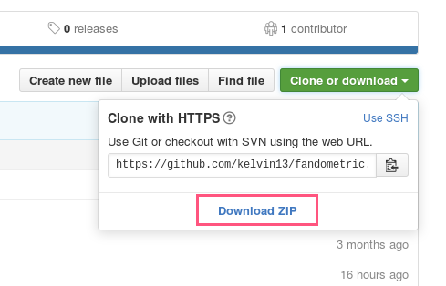

Fandometric
---

A command line utility for tracking your tumblr following.

Run with the python 3.5 console:

```
>>> cd fandometric
>>> python3.5
>>> import fandometric
>>> fandometric.changes(url, 0, -1)
```

# First time use

Fandometric works by taking snapshots of your tumblr following and comparing the changes between them. To do this, Fandometric needs access to your tumblr account. To do this, create a file named `tumblr_keys.txt` in the top level `fandometric` directory (the same directory that contains this `readme.md` file. The file should contain four, and only four OAuth keystrings, each on a separate line.

```
xxxxxxxxxxxxxxxxxxxxxxxxxxxxxxxxxxxxxxxxxxxxxxxxxx
xxxxxxxxxxxxxxxxxxxxxxxxxxxxxxxxxxxxxxxxxxxxxxxxxx
xxxxxxxxxxxxxxxxxxxxxxxxxxxxxxxxxxxxxxxxxxxxxxxxxx
xxxxxxxxxxxxxxxxxxxxxxxxxxxxxxxxxxxxxxxxxxxxxxxxxx
```

## Getting your OAuth keys
If you have never used the [tumblr API](https://www.tumblr.com/docs/en/api/v2#auth), you will have to [register this application](https://www.tumblr.com/oauth/apps) with tumblr. That sounds more difficult than it is.

Simply go to the (https://www.tumblr.com/oauth/apps)[registration page] enter the required info:

| field | value |
| --- | --- |
| Application Name | can be anything |
| Application Description | can be anything |
| Administrative contact email | your email |
| Default callback URL | '/' (forward slash, without quotes) |

Register the application. Then on the apps page, go through **explore api** and click through the authorization page. (Yes, this will allow the app to do anything to your account, including post and follow, but this is now your app; you registered it yourself.)



The `User: Info` page will have your four keys stored in various formats. Which ones you choose are not important, as long as you take all four at a time, in the order that they appear. (The keys in the screenshot are from the `show keys` button.) Paste them into your `tumblr_keys.txt` file from earlier, four keys on four separate lines, in the order they appear on the website. **Never share your OAuth keys; they are more or less equivalent to your tumblr password.**


Fandometric is now linked to your tumblr account and ready to use.

## Usage
Fandometric is a python console application. It can also be loaded as a library. In the top `fandometric` folder, run the following terminal commands to start python and load Fandometric
```
>>> cd fandometric
>>> python3.5
>>> import fandometric
```
The `fandometric.changes` function is a convenience function that downloads the latest follower/following list for your account from tumblr and compares it with itself. Replace `blogname` with the url of your tumblr blog, in quotes (a tumblr url does not include “http://” or “.tumblr.com”).
```
>>> fandometric.changes(<blogname>)
```
To compare with the last saved snapshot (comparing a follower list with itself isn’t terribly useful), include the two comparison index parameters `0, -1`.
```
>>> fandometric.changes(<blogname>, 0, -1)
```


Comparisons will fail when you run Fandometric for the first time and ask it to perform a comparison with a previous snapshot, because it will have nothing to compare your follower/following list to. Snapshots are saved in a directory called `records` and may be freely deleted to clean out your records. Fandometric refers to these files by their numeric indexes.

## Advanced usage
`fandometric.changes` combines two operations—list downloading, and list comparison—that Fandometric provides separately through the functions `fandometric.update` and `fandometric.compare`.

`fandometric.update(url[, directory='records'])`

Fetches the follower and following lists from tumblr and saves the data as `n.txt`, where `n` is one greater than the highest numbered file in `directory`.

* **url** : the tumblr url of your primary blog. *(required)*
* **directory** : the directory Fandometric will save the snapshot in. Must be free of all non-snapshot files.

`fandometric.compare(a=0, b=a, directory='records')`

Compares the `a`th last and `b`th last snapshots in `directory`. The parameters `a` and `b` are counted backwards from the highest numbered file in `directory`. For example, if `1989.txt` is the highest numbered file in `directory`, `0` will refer to `1989.txt` and `-1` will refer to `1988.txt`. `a` and `b` can be in any order; Fandometric will compare the higher number to the lower. If any of the referenced files does not exist, comparison will fail.

* **a** : the reverse index of the first snapshot to compare. Sign is irrelevant; `-1` and `1` are equivalent. Defaults to `0`.
* **b** : the reverse index of the second snapshot to compare. Sign is irrelevant; `-1` and `1` are equivalent. Defaults to the value of `a` (self comparison).
* **directory** : the directory Fandometric will search for `a` and `b` in. Must be free of all non-snapshot files.


## Comparison output
| lost followers | |
| --- | --- |
| `exists` | the blog currently exists on tumblr |
| `deleted` | the blog no longer exists on tumblr |
| `unknown` | Fandometric was unable to verify the existence of this blog |
| `mutual` | You followed this blog at the time of the second snapshot |
| `—` | You did not follow this blog at the time of the second snapshot |

| gained followers | |
| --- | --- |
| `new` | this blog is a new follower (always `new`)
| `mutual` | You followed this blog at the time of the second snapshot |
| `—` | You did not follow this blog at the time of the second snapshot |

| stats ||
| --- | --- |
| `ratio=u/v (u:v)` | The ratio of followers to following at the time of the second snapshot |
| `p% inactive following (n blogs)` | The proportion and number of inactive blogs that you follow (inactivity defined as greater than one week) |
| `p% inactive followers (n blogs)` | The proportion and number of inactive blogs that follow you (inactivity defined as greater than one week)
